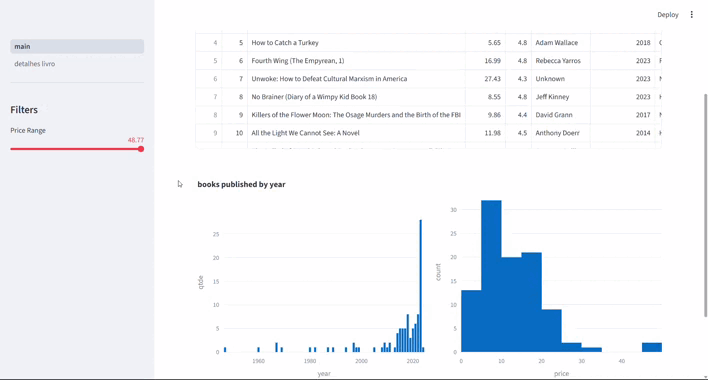

# 📚 Book Insights & Reviews Dashboard

Este dashboard interativo foi desenvolvido em **Python** utilizando a biblioteca **Streamlit**. O objetivo é oferecer uma interface visual e intuitiva para explorar dados de livros populares e analisar as avaliações dos consumidores em tempo real.

---

## 🎓 Origem do Projeto

Este projeto foi desenvolvido como parte da trilha de aprendizado da **Asimov Academy**. Durante o desenvolvimento, foquei em transformar dados brutos em uma interface web funcional e amigável.

### 🚀 Diferenciais e Melhorias Implementadas

Para tornar o projeto mais estável e funcional, adicionei as seguintes melhorias:

- **Limpeza de Dados (Sanitização):** Implementação de remoção automática de espaços extras nos nomes das colunas (`str.strip()`), evitando erros de leitura comuns em datasets.
- **Tratamento de Erros:** Adição de verificações para evitar que o aplicativo pare de funcionar caso um livro selecionado não possua dados ou apresente erro de busca.
- **Interface Otimizada:** Organização de métricas (Preço, Avaliação, Ano) em colunas e exibição de comentários utilizando o formato de chat do Streamlit.

---

## 📊 Dataset

Os dados utilizados foram extraídos do **Kaggle**, uma plataforma de ciência de dados.

- **Fonte dos Dados:** [Top 100 Bestselling Book Reviews on Amazon (Kaggle)](https://www.kaggle.com/datasets/anshtanwar/top-200-trending-books-with-reviews)

---

## 📸 Visual do Projeto

_Página Inicial_

_Reviews_


---

## 🛠️ Tecnologias Utilizadas

- **Python 3.12.12**
- **Pandas** (Processamento e limpeza de dados)
- **Streamlit** (Interface Web e Dashboard)

---

## 🔧 Como Rodar o Projeto

Para testar este projeto na sua máquina, siga os passos abaixo no seu **terminal** (Prompt de Comando ou PowerShell):

1. **Clonar o repositório:**
   ```bash
   git clone https://github.com/GabsPassos/analise-top100-livros-amazon-2009-2021-
   ```
2. **Entrar na pasta que foi criada:**
   ```bash
   cd analise-top100-livros-amazon-2009-2021-
   ```
3. **Instalar as bibliotecas necessárias:**
   ```bash
   pip install pandas streamlit
   ```
4. **Rodar o aplicativo:**
   ```bash
   streamlit run main.py
   ```

---

💡 _Desenvolvido com fins educativos sob a mentoria da Asimov Academy e dados fornecidos pelo Kaggle._
